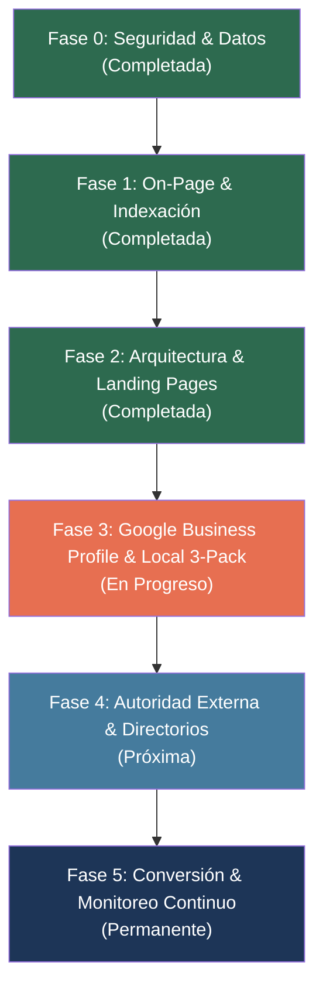

# 🎯 Plan Estratégico y Objetivos SEO — Dra. Odette Noyola
## Dominio: `draodettenoyola.com` | Especialidad: Ginecología, Obstetricia & Medicina Materno Fetal
**Ubicación:** Chapalita Oriente, Guadalajara / Zapopan, Jalisco  
**Fecha de actualización:** 8 de septiembre de 2026  
**Responsable técnico:** Mr. Dev

---

## 📌 Objetivo Principal (North Star Metric)

> **Posicionar a la Dra. Odette Noyola en el Top 3 orgánico de Google y en el Google Maps Local 3-Pack** para las búsquedas clave de **"Ginecóloga en Guadalajara"**, **"Chequeo Ginecológico Guadalajara"** y **"Consulta Ginecológica Zapopan / Chapalita"**, generando un flujo predecible de pacientes particulares y asegurados.

---

## 📊 Matriz de KPIs y Metas Cuantificables

| Métrica | Estado Inicial (Sep 2026) | Meta a 30 Días | Meta a 90 Días | Estado Actual |
|---|---|---|---|---|
| **Páginas Descubiertas (GSC)** | 6 páginas | 10 páginas | 15+ páginas | 🟢 **9 páginas** |
| **Páginas Indexadas en Google** | 3 páginas | 8 páginas | 12+ páginas | 🟡 **En cola prioritaria** |
| **Impresiones Semanales** | ~27 impresiones | 150+ impresiones | 1,000+ impresiones | 📈 Creciendo |
| **Palabras Clave Posicionadas** | 11 (solo ultrasonido) | 35+ (ginecología) | 70+ clusters | 🟡 Fase de indexación |
| **Posición Promedio Orgánica** | 32.2 | < 20.0 | Top 10 (Long-tail) | ⏳ En evaluación |
| **Lighthouse SEO (Móvil)** | Variable | 100 / 100 | 100 / 100 | 🏆 **100 / 100** |
| **Lighthouse Accesibilidad** | 87 / 100 | 90+ / 100 | 95+ / 100 | 🟢 **91 / 100** |
| **Reseñas en Google Maps** | 5 estrellas (< 10) | 15+ reseñas | 30+ reseñas | 🟡 Estrategia activa |

---

## 🗺️ Desglose de Objetivos por Fases

---

### ✅ FASE 0: Blindaje de Seguridad y Limpieza Crítica (COMPLETADA)
- [x] **Eliminación de fuga de datos en `manifest.json`:** Se eliminó exportación residual de WhatsApp con chats y teléfonos privados; se reemplazó por un manifiesto PWA formal.
- [x] **Protección en `server.js`:** Middleware para bloqueo de acceso público a archivos confidenciales (`.md`, `.env`, `.ps1`, imágenes brutas `AC*.jpg`, carpeta `data/`).
- [x] **Cabeceras de seguridad:** Implementación de HSTS (`Strict-Transport-Security`) y `Referrer-Policy` en `render.yaml`.
- [x] **Sincronización CMS:** Ajuste en `data/content.json` para alinear el H1 a *"Ginecóloga en Guadalajara"* y evitar sobreescrituras accidentales desde el panel admin.

---

### ✅ FASE 1: Fundamentos Técnicos & On-Page SEO (COMPLETADA)
- [x] **Optimización H1 y Meta Tags:** Jerarquía semántica alineada al clúster de máxima intención de búsqueda local.
- [x] **Datos Estructurados Schema.org:** Implementación de grafo JSON-LD con 8 entidades interconectadas (`Physician`, `MedicalBusiness`, `LocalBusiness`, `Organization`, `WebSite`, `FAQPage`, `MedicalProcedure`).
- [x] **Depuración de archivos pesados:** Archivo de 102 archivos huérfanos/dev (~27.7 MB) en `_source/` fuera de producción.
- [x] **Reglas de rastreo:** Actualización de `robots.txt` para bloquear directorios internos.
- [x] **Verificación en Google Search Console:** Propiedad de dominio `sc-domain:draodettenoyola.com` verificada, sitemap enviado y re-procesado exitosamente.

---

### ✅ FASE 2: Expansión de Contenido & Silo de Enlaces (COMPLETADA)
- [x] **Nueva Landing Page de Alta Conversión:**  
  [`/consulta-ginecologica-guadalajara.html`](consulta-ginecologica-guadalajara.html)  
  *Objetivo:* Captar búsquedas de consulta general, SOP, miomas, anticoncepción y segunda opinión ($800 MXN).
- [x] **Nueva Landing Page Transaccional:**  
  [`/chequeo-ginecologico-guadalajara.html`](chequeo-ginecologico-guadalajara.html)  
  *Objetivo:* Captar búsquedas transaccionales de *"chequeo ginecológico precio"* y *"papanicolaou en Guadalajara"* con paquete integral de $1,200 MXN.
- [x] **Optimización de Rendimiento Web:**  
  Atributos `defer` en scripts JS para eliminar bloqueo de renderizado; atributos `width`/`height` y alt text semántico en todas las imágenes de galería y contenido.
- [x] **Accesibilidad WCAG:**  
  Punto de referencia `<main id="main-content">`, objetivos táctiles de 48×48px en enlaces móviles y orden descendente de encabezados.
- [x] **Silo de Enlazado Interno:**  
  Tarjetas de servicio en `index.html` conectadas a las landings hijas; enlazado cruzado desde el blog médico.
- [x] **Actualización de Sitemap:**  
  Ambas landings dadas de alta con prioridad `0.95` en [`sitemap.xml`](sitemap.xml). Discovered pages subió de 6 a 9.

---

### 🚀 FASE 3: Dominancia en Google Maps & Perfil de Empresa (EN PROGRESO)
- [ ] **Acceso y Administración:** Vincular la cuenta `carlos.aceves6195@alumnos.udg.mx` como Administrador de la ficha oficial gestionada en `odettelandazuri@gmail.com`.
- [ ] **Categoría Principal:** Fijar como categoría primaria `Ginecólogo` (o `Ginecóloga`).
- [ ] **Categorías Secundarias:** Activar `Obstetra`, `Especialista en medicina materno-fetal` y `Clínica de salud para mujeres`.
- [ ] **Descripción Comercial (749/750 car.):** Cargar texto persuasivo con geolocalización exacta en Chapalita Oriente y palabras clave estratégicas.
- [ ] **Catálogo de Servicios con Precios:**
  1. *Chequeo Ginecológico Completo ($1,200 MXN)*
  2. *Consulta Ginecológica Integral ($800 MXN)*
  3. *Ultrasonido Estructural Fetal ($1,700 MXN)*
  4. *Tamizaje Genético de Primer Trimestre ($1,700 MXN)*
  5. *Ultrasonido Tercer Trimestre con Doppler ($1,500 MXN)*
  6. *Colocación de DIU e Implante Anticonceptivo (A consultar)*
  7. *Control Prenatal y Embarazo de Alto Riesgo ($800 MXN)*
- [ ] **Galería Visual de Ficha:** Subir fotos en alta definición de fachada, consultorio interior, ecógrafo GE Voluson y foto profesional de la doctora.

---

### 🌐 FASE 4: Autoridad Externa, Directorios & Reseñas (PRÓXIMA)
- [ ] **Doctoralia / Top Doctors:** Sincronizar descripciones, cédulas y enlazar directamente a las landings especializadas de `draodettenoyola.com`.
- [ ] **Estrategia Sistemática de Reseñas (Google Reviews):**
  - Implementar QR físico en recepción con enlace directo: `https://g.page/r/CST5pYN0eyRqEAI/review`.
  - Plantilla de seguimiento post-consulta vía WhatsApp a las 24-48 horas.
  - Meta: Alcanzar 30+ reseñas de 5 estrellas en los primeros 60 días.
- [ ] **Citas Locales (NAP Consistency):** Asegurar coincidencia idéntica de Nombre, Dirección y Teléfono en todos los portales médicos.

---

### 📈 FASE 5: Medición, Analítica & Retención (PERMANENTE)
- [ ] **Monitoreo de Search Console:** Seguimiento quincenal de consultas emergentes y tasa de clics (CTR).
- [ ] **Eventos de Conversión (GA4):** Medición de clics al botón flotante de WhatsApp (`#hero-whatsapp-btn`, llamadas telefónicas y formularios).
- [ ] **Monitoreo de Core Web Vitals:** Auditoría de LCP, FID/INP y CLS en condiciones reales de tráfico móvil en México.

---

*Documento creado para seguimiento y control de gestión del proyecto SEO Dra. Odette Noyola.*
